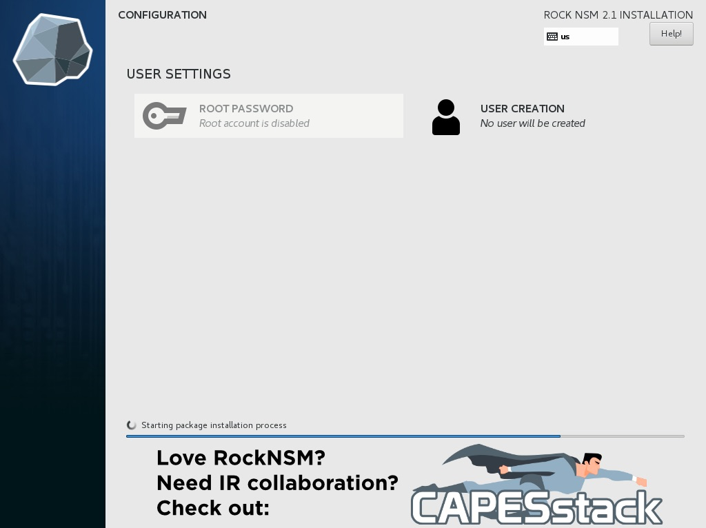

<p align="center">

</p>

# Installation Guide

#### Agenda
- [overview](#overview)
- [getting the bits](#getting-media)
- [apply image](#applying-the-image)
- [first boot](#first-boot)
- [review config](#review-configuration)
- [deploy](#deploy)


## Overview

If there’s one thing that should be carried away from the installation section, it's this:

> RockNSM has been designed to be used as a distro. It's not a package or a suite of tools. It’s built from the ground up purposefully.  THE ONLY SUPPORTED INSTALL IS THE OFFICIAL ISO.

Yes, one can clone the project and run the Ansible on some bespoke CentOS build and may have great success. But you've voided the warranty.  Providing a clean product that makes supporting submitted issues is important to us.  The ISO addresses most use cases.


## Getting Media

As just mentioned, there's an automated build available here:  
[link](@todo)
<!-- https://github.com/rocknsm/rock/releases -->


## Apply the Image

Now it's time to create a bootable USB drive with that fresh ROCK build.  Let's look at few options.   

#### CLI

If you live in the terminal, use `dd` to apply the image.  These instructions are for using a terminal in macOS.  If you're in a different environment, google is your friend.  

> NOTE: Be **careful** when using these commands by **ensuring** you're writing to the correct disk / partition:

1. once you've inserted a USB get the drive ID:  
`diskutil list`  

2. unmount the target drive so you can write to it:  
`diskutil unmountDisk /dev/disk#`  

3. write the image to drive:  
`sudo dd bs=8M if=path/to/rockiso of=/dev/disk#`  

#### Via GUI

macOS:  if using the terminal is currently a barrier to getting things rolling, [etcher.io](http://etcher.io) is an excellent GUI burning utility.  

Windows:  there are several great tools to apply a bootable image in MS land, but we recommend [rufus](https://rufus.akeo.ie/).  


## First Boot

ROCK will work with both legacy BIOS and UEFI boot settings.  Once booted to the USB, you are presented with 2 primary options:

<p align="center">

</p>

##### Automated

The automated build strives to make some of the harder decisions for users by skipping over many options to get you up and running.

##### Custom

The Custom option uses the same settings as Automated, but pauses at the install screen that will allow advanced users to customize how to configure your sensors storage.  This is especially helpful when you're working with multiple drives.  

For this guide select the **Automated** install and `ENTER`.

### User Creation

<p align="center">

</p>

ROCK is configured with the root user disabled.  We recommend that you leave it that way.  Once you've kicked off the install, click **User Creation** at the next screen and complete the required fields to set up a (non-root) admin user.  

> If this step is not completed now do not fear, you will be prompted to create this account after first login.

- click **Finish Installation** and wait for reboot

- accept licensing agreement: `c` + "*enter*"

- update Centos to current by running: `sudo yum update -y && reboot`


## Review Configuration

One of the primary tasks complete during install is the creation of the file `/etc/rocknsm/config.yml`.  This file contains key variables like network interface setup, cpu cores used, what components are enabled, and more.

> TIP: take care with these options as this file will be read during the next step, deployment.

For example:  if you wish to run an offline install (the ISO sets you up for this already) edit `/etc/rocknsm/config.yml` and change the following (line 30):

```
rock_online_install: False
```

If this value is set to `True`, Ansible will configure your system for the yum repositories listed and pull packages and git repos directly from the URLs given. You could easily point this to local mirrors, if needed.

If this value is set to `False`, Ansible will look for the cached files in `/srv/rocknsm`. There is another script called `offline-snapshot.sh` that will create the necessary repository and file structure. Run this from a system that is Internet connected and copy it to your sensors for offline deployment.

While you're in there, you can change the auto-detected defaults, such as which interfaces to use, hostname, fqdn, resources to use, etc. You can also disable features altogether at the bottom by simply changing the feature value to `False` as shown below. Don't do this unless you know what you're doing.

```
with_nginx: False
```

This disables nginx from installing or being configured. Note that it will not remove it if it is already present.


## Deploy

Once your `config.yml` file is tuned to your situation, it's time to deploy!  This is done by running the deployment script:

-  `cd /opt/rocknsm/rock/bin/`

-  `sudo ./deploy_rock.sh`

If everything is well, this should set up all the components you selected and give you a success banner similar to the example below:

<p align="center">
<a href="https://asciinema.org/a/2rS2u1fJzhaNVtkuKWgqd5BQl" target="_blank"></a>
</p>

> NOTE: If you find the deployment is failing, the script can be run with very verbose output.  This example will write the output to a file for review:  `DEBUG=1 ./deploy_rock.sh | tee /tmp/deploy_rock.log`

---

Continue to the [Usage Guide](usage.md).

> NOTE: for a detailed guide on how to set up a virtual machine to throw packets at see the [VM Build Guide](../dev/vm_guide.md) wiki/dev section.
