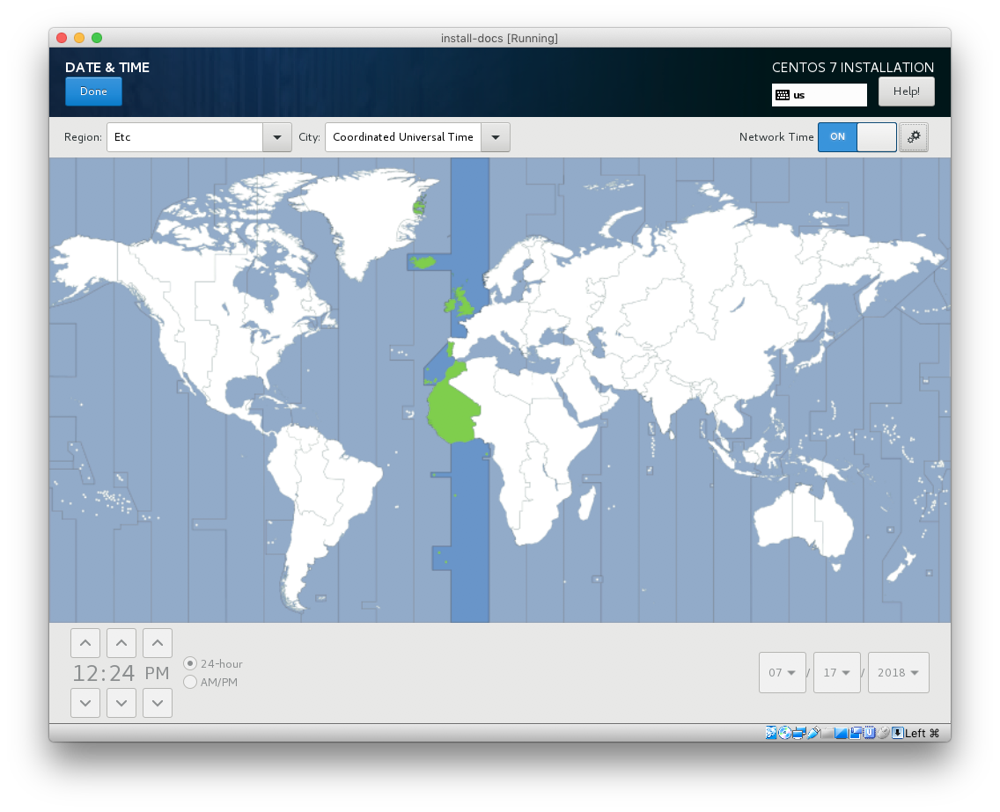
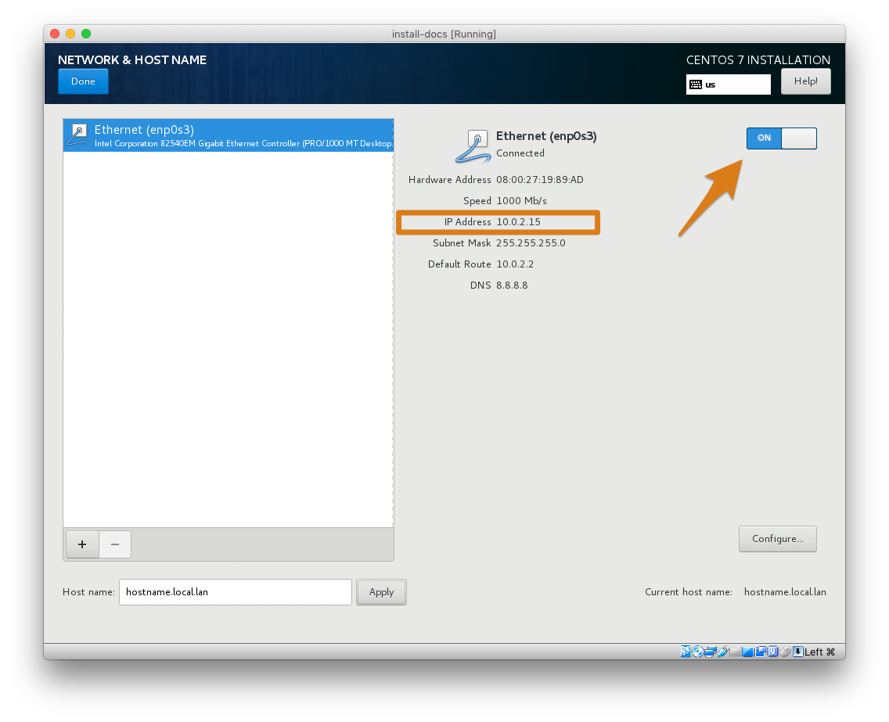

<p align="center">

</p>

# Installation Guide

#### Agenda
- [Overview](#overview)
- [Getting the Bits](#getting-media)
- [Applying the Image](#apply-the-image)
- [Install](#install)
- [Configure](#configure)
- [Deploy](#deploy)


## Overview

If there’s one thing that should be carried away from the installation section, it's this:  

> RockNSM has been designed to be used as a distro. It's not a package or a suite of tools. It’s built from the ground up purposefully.  THE ONLY SUPPORTED INSTALL IS THE OFFICIAL ISO.

Yes, one can clone the project and run the Ansible on some bespoke CentOS build, and you may have great success... but you've **voided the warranty**.  Providing a clean product that makes supporting submitted issues is important to us.  The ISO addresses most use cases.


## Getting Media

The lastest ROCK build is available at [download.rocknsm.io](https://download.rocknsm.io/isos/stable/).


## Apply the Image

Now it's time to create a bootable USB drive with the fresh ROCK build.  Let's look at few options.   

#### CLI

If you live in the terminal, use `dd` to apply the image.  These instructions are for using a terminal in macOS.  If you're in a different environment, google is your friend.  

:warning: Take CAUTION when using these commands by ENSURING you're writing to the correct disk / partition! :warning:

1. once you've inserted a USB get the drive ID:  
`diskutil list`  

2. unmount the target drive so you can write to it:  
`diskutil unmount /dev/disk#`  

3. write the image to drive:  
`sudo dd bs=8m if=path/to/rockiso of=/dev/disk#`  

#### Via GUI

If you don't want to apply the image in the terminal, there are plenty of great tools to do this with a graphical interface:

**Cross-platform**
-  [Etcher](http://etcher.io) - our go-to standard
- [YUMI](https://www.pendrivelinux.com/yumi-multiboot-usb-creator/) - create multibooting disk
-  [SD Card Formatter](https://www.sdcard.org/downloads/formatter_4/) - works well

**Windows**
- [Win32 Disk Imager](https://sourceforge.net/projects/win32diskimager/)


## Installation

<p align="center">

</p>


#### Network Connection

During install, ROCK will see the network interface with an ip address and default gateway and designate it as the _**management**_ port. So plug into the interface you want to use to remotely manage your sensor.

### Install Types

ROCK works with both legacy BIOS and UEFI booting.  Once booted from the USB, you are presented with 2 primary installation paths:  

* Automated
* Custom

#### Automated

The "Automated" option is intended to serve as a _**starting point**_ that allow you to get into things.  It utilizes the Centos Anaconda installer to make some of the harder decisions for users by skipping over many options to get you up and running. It makes a best guess at how to use resources.


#### Custom

The "Custom" allows more advanced users to customize their configuration. This is especially helpful when you're working with multiple disks and/or a large amount of storage on a single disk. Custom is encouraged for a production environment in order to get more granular in choosing how disk space is allocated.

If your target machine to use as a ROCK sensor has multiple disks to use it is **highly recommended** to select "Custom install". This is because the default RHEL (and even other linux distributions) partioning will use the majority of the storage for the `/home` partion.


##### Custom - Disk Allocation

Configuring disk and storage is a deep topic on it's own, but let's talke about a few examples to get started:  

##### Stenographer

A common gotcha occurs when you want full packet capture (via [Stenographer](../services/stenographer.md)), but it isn't given a separate partition.  Stenographer is great at managing it's own disk space (starts to overwrite oldest data at 90% capacity), but that doesn't cut it when it's sharing the same mount point as Bro, Suricata , and other tools that generate data in ROCK.

Best practice would be to create a `/data/stenographer` partition in order to prevent limited operations. For example, Elasticsearch will (rightfully) lock indexes up to a read-only state in order to keep things from crashing hard.

##### Separating System Logs

Another useful partition to create is `/var/log` to separate system log files from the rest of the system.

##### Partitioning Example

Below is a good starting point when partitioning

|   MOUNT POINT   |        USAGE      |   SIZE   |
| ---------- | ----------------- | -------- |
| **SYSTEM** | **SYSTEM** | **SYSTEM** |
| /          | root filesystem   | 15 GiB   |
| /boot      | legacy boot files | 512 MiB  |
| /boot/efi  | uefi boot files   | 512 MiB  |
| swap       | memory shortage   | ~8 GiB+ |
| **DATA** | **DATA** | **DATA** |
| /var/log           | system log files | ~15 GiB |
| /home              | user home dirs | ~20 GiB |
| /data              | data partition | ~ GiB |
| /data/stenographer | steno partition | ~ GiB |
<br>

For more information to assist with the partitioning process, you can see the [RHEL guide](https://access.redhat.com/documentation/en-us/red_hat_enterprise_linux/7/html/installation_guide/sect-disk-partitioning-setup-x86#sect-custom-partitioning-x86). Also, it may be a bit more self explanatory for you if you click “automatic partitions” then modify accordingly.

<br>
> For the purposes of simplicity this guide will demonstrate an **Automated** install.  If you have multiple disks to configure use the _Custom_ option.  

<br>

##### DATE & TIME

`UTC` is generally preferred for logging data as the timestamps from anywhere in the world will have a proper order without calculating offsets and daylight savings. That said, Kibana will present the Bro logs according to your timezone (as set in the browser). The bro logs themselves (i.e. in /data/bro/logs/) log in [epoch time](https://en.wikipedia.org/wiki/Unix_time) and will be written in UTC regardless of the system timezone.

<p align="center">

</p>

Bro includes a utility for parsing these on the command line called `bro-cut`. It can be used to print human-readable timestamps in either the local sensor timezone or UTC. You can also give it a custom format string to specify what you'd like displayed.

##### Caveat: Environments without NTP access
If RockNSM does not have access to an NTP server, you must ensure that your system time is set to the current UTC time.  If your system clock is set to local time, you will notice an incorrect time offset in your data.  To resolve/prevent this, set the clock to the correct UTC time:
```
sudo timedatectl set-ntp false
sudo timedatectl set-time '2019-03-02 00:35:02'
sudo timedatectl set-ntp true
```

##### Network & Hostname

Before beginning the install process it's best to connect the interface you've selected to be the **management interface**.  Here's the order of events:  

- ROCK will initially look for an interface with a default gateway and treat that interface as the MGMT INTERFACE
- All remaining interfaces will be treated as MONITOR INTERFACES

1. Ensure that the interface you intend to use for MGMT has been turned on and has an ip address
2. Set the hostname of the sensor in the bottom left corner
  - this hostname will populate the Ansible inventory file in `/etc/rocknsm/hosts.ini`  

<p align="center">

</p>

##### User Creation

ROCK is configured with the root user disabled.  We recommend that you leave it that way.  Once you've kicked off the install, click **User Creation** at the next screen (shown above) and complete the required fields to set up a non-root admin user.  

<p align="center">

</p>

> If this step is not completed now do not fear, you will be prompted to create this account after first login.

- click **Finish Installation** and wait for reboot
- accept license agreement: `c` + `ENTER`


## Configure

The primary configuration file for ROCK is [/etc/rocknsm/config.yml](https://github.com/rocknsm/rock/blob/master/playbooks/templates/rock_config.yml.j2).  This file contains key variables like network interface setup, cpu cores assignment, and much more.  There are a lot of options to tune here, so take time to familiarize.  Let's break down this file into it's major sections:  


##### Network Interfaces
As mentioned previously, ROCK takes the interface with a default gateway and will uses as MGMT.  Beginning at line 8, `config.yml` displays the remaining interfaces that will be used to **MONITOR** traffic.
```
# The "rock_monifs:" listed below are the interfaces that were not detected
# as having an active IP address. Upon running the deploy script, these
# interfaces will be configured for monitoring (listening) operations.
# NOTE: management interfaces should *not* be listed here:

rock_monifs:
  - <interface>
  - <interface>
```

##### Realworld Example
```
[admin@rock ~]$ ip a

1: lo: <LOOPBACK,UP,LOWER_UP> mtu 65536 qdisc noqueue state UNKNOWN group default qlen 1000
2: enp0s3: <BROADCAST,MULTICAST,UP,LOWER_UP> mtu 1500 qdisc pfifo_fast state UP group default qlen 1000
    link/ether ...
    inet 192.168.1.207/24 brd 192.168.1.255 scope global noprefixroute dynamic enp0s3
    ...
3: enp0s4: <BROADCAST,MULTICAST,UP,LOWER_UP> mtu 1500 qdisc pfifo_fast state UP group default qlen 1000
    link/ether ...
```


Let's run through the above basic example to illustrate. The demo box has 2 NICs:
1. `enp0s3` - is plugged in for install and deployment with an ip address from local dhcp. This will be used to **manage** the sensor
2. `enp0s4` - will be disconnected (unused) during install and deployment and be listed as a `rock_monif` in the config file

Lines 7 - 9 of `/etc/rocknsm/config.yml` show that the other interface (`enp0s3`) is listed as MONITOR interface.
```yml
# interfaces that should be configured for sensor applications
rock_monifs:
    - enp0s3
```


##### Sensor Resource Configuration
```
# Set the hostname of the sensor:
rock_hostname:

# Set the Fully Qualified Domain Name:
rock_fqdn:

# Set the number of CPUs assigned to Bro:
bro_cpu:

# Set the Elasticsearch cluster name:
es_cluster_name:

# Set the Elasticsearch cluster node name:
es_node_name:

# Set the value of Elasticsearch memory:
es_mem:
```


##### Installation Source Configuration
We've taken into consideration that your sensor won't always have internet access.  The ISO's default value is set to offline:  

```yml
53  # The primary installation variable defines the ROCK installation method:
54  # ONLINE:   used if the system may reach out to the internet
55  # OFFLINE:  used if the system may *NOT* reach out to the internet
56  # The default value "False" will deploy using OFFLINE (local) repos.
57  # A value of "True" will perform an install using ONLINE mirrors.
58
59  rock_online_install: True
```

If your sensor does have access to get to online repos just set `rock_online_install: True`, Ansible will configure your system for the yum repositories listed and pull packages and git repos directly from the URLs shown. You can easily point this to local mirrors if needed.  

If this value is set to `False`, Ansible will look at the cached files in `/srv/rocknsm`.

<!-- There is another script called `offline-snapshot.sh` that will create the necessary repository and file structure. Run this from a system that is Internet connected and copy it to your sensors for offline deployment. -->


#### Data Retention Configuration

This section controls how long NSM data stay on the sensor:
```
# Set the interval in which Elasticsearch indexes are closed:
elastic_close_interval:

# Set the interval in which Elasticsearch indexes are deleted:
elastic_delete_interval:

# Set value for Kafka retention (in hours):
kafka_retention:

# Set value for Bro log retention (in days):
bro_log_retention:

# Set value for Bro statistics log retention (in days):
bro_stats_retention:

# Set how often logrotate will roll Suricata log (in days):
suricata_retention:

# Set value for FSF log retention (in days):
fsf_retention:
```


##### ROCK Component Options
This is a critical section that provides boolean options to choose what components of ROCK are **_installed_** and **_enabled_** during deployment.  

```yml
# The following "with_" statements define what components of RockNSM are
# installed when running the deploy script:

with_stenographer: True
with_docket: True
with_bro: True
with_suricata: True
with_snort: True
with_suricata_update: True
with_logstash: True
with_elasticsearch: True
with_kibana: True
with_zookeeper: True
with_kafka: True
with_lighttpd: True
with_fsf: True

# The following "enable_" statements define what RockNSM component services
# are enabled (start automatically on system boot):

enable_stenographer: True
enable_docket: True
enable_bro: True
enable_suricata: True
enable_snort: True
enable_suricata_update: True
enable_logstash: True
enable_elasticsearch: True
enable_kibana: True
enable_zookeeper: True
enable_kafka: True
enable_lighttpd: True
enable_fsf: True
```

A good example for changing this section would involve [Stenographer](../services/stenographer.md). Collecting raw PCAP is resource and _**storage intensive**_.  You're machine may not be able to handle that and if you just wanted to focus on network logs, then you would set both options in the config file to **disable** both installing and enabling Steno:  

```yml
67 with_stenographer: False
  ...
  ...
  ...
83 enable_stenographer: False
```


## Deployment

Once `config.yml` has been tuned to suit your environment, it's finally time to **deploy this thing**.  This is done by running the deployment script, which is in the install user's path (`/usr/sbin/`):  

```
/usr/sbin/
├── ...
├── deploy_rock.sh.sh
├── ...
```

To kick off the deployment script run:  `sudo deploy_rock.sh`  

Once the deployment is completed with the components you chose you'll be congratulated with a success banner.  

<p align="center">
<a href="https://asciinema.org/a/2rS2u1fJzhaNVtkuKWgqd5BQl" target="\_blank"></a>
</p>  


#### Generate Defaults

> What do I do when I've completely messed things up and need to start over?

Great question.  There's a simple solution for when the base config file needs to be reset back to default settings. There's a script called `generate_defaults.sh` also located in your `$PATH`:  

`sudo generate_defaults.sh`  

Simply execute this to (re)generate a fresh default `config.yml` for you and get you out of jail.  

## Initial Kibana Access

We strive to do the little things right, so rather than having Kibana available to everyone in the free world it's sitting behind an Nginx reverse proxy. It's also secured by a [passphrase](https://xkcd.com/936/).  The credentials are generated and then stored in the home directory of the user you created during the initial installation e.g. `/home/admin`.

1. `cat` and copy the contents of `~/KIBANA_CREDS.README`
1. browse to https://<MANAGEMENT-IP>
1. enter this user / password combo
1. profit!

---

Continue to the [Usage Guide](../operate/index.md).

<!-- > NOTE: for a detailed guide on how to set up a virtual machine to throw packets at, see the [VM Build Guide](./vm_guide.md). -->
