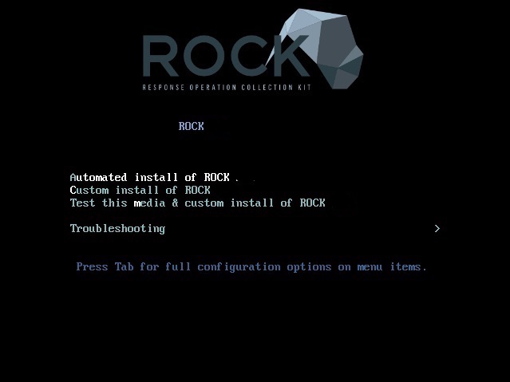

<p align="center">

</p>

# Installation Guide

#### Agenda
- [overview](#overview)
- [getting the bits](#getting-media)
- [apply image](#apply-the-image)
- [install](#install)
- [configure](#configure)
- [deploy](#deploy)


## Overview

If there’s one thing that should be carried away from the installation section, it's this:  

> RockNSM has been designed to be used as a distro. It's not a package or a suite of tools. It’s built from the ground up purposefully.  THE ONLY SUPPORTED INSTALL IS THE OFFICIAL ISO.

Yes, one can clone the project and run the Ansible on some bespoke CentOS build and may have great success. But you've voided the warranty.  Providing a clean product that makes supporting submitted issues is important to us.  The ISO addresses most use cases.


## Getting Media

The lastest ROCK build is available here: (https://download.rocknsm.io/)  


## Apply the Image

Now it's time to create a bootable USB drive with the fresh ROCK build.  Let's look at few options.   

#### CLI

If you live in the terminal, use `dd` to apply the image.  These instructions are for using a terminal in macOS.  If you're in a different environment, google is your friend.  

:warning: Take CAUTION when using these commands by ENSURING you're writing to the correct disk / partition! :warning:

1. once you've inserted a USB get the drive ID:  
`diskutil list`  

2. unmount the target drive so you can write to it:  
`diskutil unmountDisk /dev/disk#`  

3. write the image to drive:  
`sudo dd bs=8M if=path/to/rockiso of=/dev/disk#`  

#### Via GUI

macOS:  if using the terminal is currently a barrier to getting things rolling, [etcher.io](http://etcher.io) is an excellent GUI burning utility.  

Windows:  there are several great tools to apply a bootable image in MS land, but we recommend [rufus](https://rufus.akeo.ie/).  


## Install

#### First Boot

<p align="center">

</p>

ROCK works with both legacy BIOS and UEFI booting.  Once booted from the USB, you are presented with 2 primary paths:  

#### Automated vs. Custom install

The automated build strives to make some of the harder decisions for users by skipping over many options to get you up and running.  

The Custom option uses the same settings as Automated, but pauses at the install(anaconda) screen that will allow advanced users to customize how to configure local storage.
Custom option is especially helpful when you're working with multiple disks and or a large amount of storage on a single disk.

**If you have a large amount of storage on any of your disks**, then it is highly recommended to use custom install. This is because the default RHEL partioning will use the majority of the storage for the /home partion.

For more information to help you on the Custom install, in relation to the partioning process, you can see the [RHEL guide](https://access.redhat.com/documentation/en-us/red_hat_enterprise_linux/7/html/installation_guide/sect-disk-partitioning-setup-x86#sect-custom-partitioning-x86). Also, it may be a bit more self explanatory for you if you click “automatic partitions” then modify accordingly.


For this guide select the **Automated** install and `ENTER`.  

#### DATE & TIME

UTC is generally preferred for logging data as the timestamps from anywhere in the world will have a proper order without calculating offsets and daylight savings. That said, Kibana will present the Bro logs according to your timezone (as set in the browser). The bro logs themselves (i.e. in /data/bro/logs/) log in epoch time and will be written in UTC regardless of the system timezone.

<p align="center">

</p>

Bro includes a utility for parsing these on the command line called `bro-cut`. It can be used to print human-readable timestamps in either the local sensor timezone or UTC. You can also give it a custom format string to specify what you'd like displayed.

#### Network Setup

Before beginning the install process it's best to connect the interface you've selected to be the **management interface**.  Here's the order of events:  

1. ROCK will initially look for an interface with a default gateway and treat that interface as MGMT
1. All remaining interfaces will be treated as MONITOR

Ensure that the interface you intend to use for MGMT has been turned on and has an IP:  

<p align="center">

</p>

#### User Creation

ROCK is configured with the root user disabled.  We recommend that you leave it that way.  Once you've kicked off the install, click **User Creation** at the next screen (shown above) and complete the required fields to set up a non-root admin user.  

<p align="center">

</p>

> If this step is not completed now do not fear, you will be prompted to create this account after first login.

- click **Finish Installation** and wait for reboot
- accept license agreement: `c` + `ENTER`


## Configure

The primary configuration file for ROCK is `/etc/rocknsm/config.yml`.  This file contains key variables like network interface setup, cpu cores utilized, and more.  Here's the default config file after initial install:  

```yml
---
# These are all the current variables that could affect
# the configuration of ROCKNSM. Take care when modifying
# these. The defaults should be used unless you really
# know what you are doing!

# interfaces that should be configured for sensor applications
rock_monifs:
    - enp0s3

# Secifies the hostname of the sensor
rock_hostname: simplerockbuild
# the FQDN
rock_fqdn: simplerockbuild.simplerock.lan
# the number of CPUs that bro will use
bro_cpu: 1
# name of elasticsearch cluster
es_cluster_name: rocknsm
# name of node in elasticsearch cluster
es_node_name: simplerockbuild
# how much memory to use for elasticsearch
es_mem: 1
# (optional) personal configured key for pulled pork to pull latest sigs from snort.org
pulled_pork_oinkcode: 796f26a2188c4c953ced38ff3ec899d8ae543350

########## Offline/Enterprise Network Options ##############

# configure if this system may reach out to the internet
# (configured repos below) during configuration
rock_online_install: False
# (online) enable RockNSM testing repos
rock_enable_testing: False
# (online) the URL for the EPEL repo mirror
epel_baseurl: http://download.fedoraproject.org/pub/epel/$releasever/$basearch/
# (online) the URL for the EPEL GPG key
epel_gpgurl: https://dl.fedoraproject.org/pub/epel/RPM-GPG-KEY-EPEL-7
# (online) the URL for the elastic repo mirror
elastic_baseurl: https://artifacts.elastic.co/packages/6.x/yum
# (online) the URL for the elastic GPG key
elastic_gpgurl: https://artifacts.elastic.co/GPG-KEY-elasticsearch
# (online) the URL for the rocknsm repo mirror
rocknsm_baseurl: https://packagecloud.io/rocknsm/2_1/el/7/$basearch
# (online) the URL for the rocknsm GPG key
rocknsm_gpgurl: https://packagecloud.io/rocknsm/2_1/gpgkey

# (offline) the filesytem path for a local repo if doing an "offline" install
rocknsm_local_baseurl: file:///srv/rocknsm
# (offline) disable the gpgcheck features for local repos, contingent on a kickstart
# test checking for /srv/rocknsm/repodata/repomd.xml.asc
rock_offline_gpgcheck: 1

# the git repo from which to checkout rocknsm customization scripts for bro
bro_rockscripts_repo: https://github.com/rocknsm/rock-scripts.git

# the git repo from which pulled pork should be installed
pulled_pork_repo: https://github.com/shirkdog/pulledpork.git

#### Retention Configuration ####
elastic_close_interval: 15
elastic_delete_interval: 60
# Kafka retention is in Hour
kafka_retention: 168
# Log Retemtion in Days
bro_log_retention: 0
bro_stats_retention: 0
suricata_retention: 3
fsf_retention: 3

### Advanced Feature Selection ######
# Don't flip these unless you know what you're doing
with_stenographer: True
with_docket: True
with_bro: True
with_suricata: True
with_snort: False
with_pulledpork: False
with_logstash: True
with_elasticsearch: True
with_kibana: True
with_zookeeper: True
with_kafka: True
with_nginx: True
with_lighttpd: True
with_fsf: True

# Specify if a service is enabled on startup
enable_stenographer: False
enable_docket: False
enable_bro: True
enable_suricata: True
enable_snort: False
enable_pulledpork: False
enable_logstash: True
enable_elasticsearch: True
enable_kibana: True
enable_zookeeper: True
enable_kafka: True
enable_nginx: True
enable_lighttpd: True
enable_fsf: False
```

All these tunable options are commented to describe the function of each section, but here are some key points to note starting out:  

#### Monitor Interface

As mentioned previously, ROCK takes the interface with a default gateway and will uses as MGMT.  Line 8 in `config.yml` displays the remaining interfaces that will be used to MONITOR traffic.  Here's a snippet from an example VM with 2 NICS:

This box has 2 NICS: `enp0s3` was plugged in during install and received IP from DHCP server.  This is used as MGMT.  
```
[admin@localhost ~]$ ip a
1: lo: <LOOPBACK,UP,LOWER_UP> mtu 65536 qdisc noqueue state UNKNOWN group default qlen 1000
2: enp0s3: <BROADCAST,MULTICAST,UP,LOWER_UP> mtu 1500 qdisc pfifo_fast state UP group default qlen 1000
    link/ether 08:00:27:06:54:e5 brd ff:ff:ff:ff:ff:ff
    inet 192.168.1.207/24 brd 192.168.1.255 scope global noprefixroute dynamic enp0s3
    ...
3: enp0s3: <BROADCAST,MULTICAST,UP,LOWER_UP> mtu 1500 qdisc pfifo_fast state UP group default qlen 1000
    link/ether 08:00:27:ca:f0:bb brd ff:ff:ff:ff:ff:ff
```

Lines 7 - 9 of `/etc/rocknsm/config.yml` show that the other interface (`enp0s3`) is listed as MONITOR interface.
```yml
7 # interfaces that should be configured for sensor applications
8 rock_monifs:
9     - enp0s3
```

#### Online / Offline Install

We've taken into consideration that your sensor won't always have internet access.  The ISO's default value is set for the offline use case:  

```yml
28 # configure if this system may reach out to the internet
29 # (configured repos below) during configuration
30 rock_online_install: False
```

If your sensor does have access to get to online repos just set `rock_online_install: True`, Ansible will configure your system for the yum repositories listed and pull packages and git repos directly from the URLs shown. You can easily point this to local mirrors if needed.  

<!-- If this value is set to `False`, Ansible will look for the cached files in `/srv/rocknsm`. There is another script called `offline-snapshot.sh` that will create the necessary repository and file structure. Run this from a system that is Internet connected and copy it to your sensors for offline deployment. -->

#### Lots More...

There are a lot of options to tune here, so take time to famililiarize a be make sure to check out the last two sections starting at `line 65`.  Here you are given boolean options to choose what components of ROCK are **_installed_** and **_enabled_** out of the box.  

For instance, collecting raw PCAP is resource and storage intensive.  If you're machine may not be able to handle that and just want to focus on network logs, then set:  

```yml
67 with_stenographer: False
  ...
83 enable_stenographer: False
```

**_Also,**_ in relation to storage/retention, is the section starting at `line 54` (Retention Configuration). This section relates to how long logs are stored in Kafka, if (raw) Bro logs are ever deleted (default is no aka `0`, and other application retention timers.

Some common configuration changes (however environmental specific requirements/needs may vary)
are as follows:
- Changing `kafka_retention` to `48` hours.
- Changing `bro_log_rentenion` to `30` days.
- Changing `bro_stats_rentenion` to `14` days.

#### Generate Defaults

So what happens when you've completely mucked things up in your config and need to get back to basic default settings?  There's a script for that called `generate_defaults.sh` located in `/opt/rocknsm/rock/bin/`.  

```
[admin@localhost ~]$ ls /opt/rocknsm/rock/bin
generate_defaults.sh
deploy_rock.sh
```

This script will regenerate a fresh default `config.yml` for you and get you out of jail.  If you need to reset things you can execute this script by running:  

`sudo ./deploy_rock.sh`


## Deploy

Once your `config.yml` file is tuned to suit your environment, it's finally time to **deploy this thing**.  This is done by running the deployment script located in `/opt/rocknsm/rock/bin/`.

Kick off the Ansible deploy script:  `sudo /opt/rocknsm/rock/bin/deploy_rock.sh`  

If everything is well, this should set up all the components you selected and give you a success banner similar to the example below:

<p align="center">
<a href="https://asciinema.org/a/2rS2u1fJzhaNVtkuKWgqd5BQl" target="_blank"></a>
</p>  

## Initial Kibana Access

We strive to do the little things right, so rather than having Kibana available to everyone in the free world it's sitting behind an Nginx reverse proxy. It's also secured by a [passphrase](https://xkcd.com/936/).  The credentials are generated and then stored in the home directory of the user you created during the initial installation e.g. `/home/admin`.

1. `cat` and copy the contents of `~/KIBANA_CREDS.README`
1. browse to (https://)<MGMT-IP>
1. enter this user / password combo
1. profit

---

Continue to the [Usage Guide](../operate/index.md).

> NOTE: for a detailed guide on how to set up a virtual machine to throw packets at, see the [VM Build Guide](./vm_guide.md).
