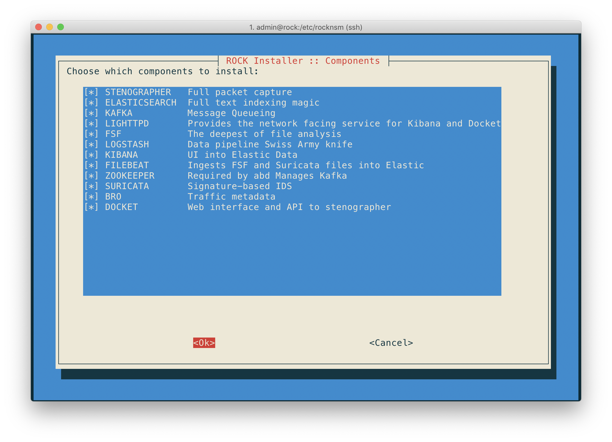
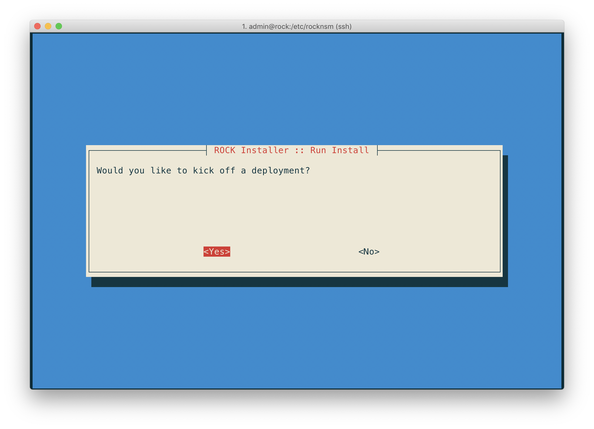

# Single Node Deployment

Let's get started and deploy a single ROCK sensor. This is the most straight
forward (and most common) way to deploy.

The TUI is an interactive user experience that improves the configuration process,
rather than manually editing a `.yml` file. But to be clear, the end goal of all
the selections made in the TUI will be writing out to `/etc/rocknsm/config.yml`.  

## Requirements

The following steps assume that you have done a fresh installation of ROCK using
 the [latest ISO](https://mirror.rocknsm.io/isos/stable/).  

## Deploy using the TUI

Let's walk through this menu line by line, starting with the first line that's
already highlighted and ready to hit <ENTER>:  Start things up by running:

$`sudo rock setup`  

### Select Interfaces

This is where we define what interfaces are used for what purposes. In this
example there are 2 interfaces to work with:

1. `ens33` - currently connected, will use for remote management
1. `ens34` - not currently connected, intended for monitor interface

Choose the interfaces you want to for your usecase, and the settings will be
reviewed before exiting:  

### Management IP

Let's choose how the management IP address is defined. We can let DHCP decide, or
set a static address:  

For this example we'll use DHCP.  

### Set Hostname

The next set allows you to set the local hostname. For this example we'll call
this box `rock01.rock.lan`.  

### Offline/Online

There are 2 options when selecting the source of installation packages:  

1. `Yes = Online` - connects to upstream repositories for packages
1. `No = Offline` - uses local packages ( located in `/srv` )

### Choose Components

Next up is selecting what components are installed during the deploy. These
choices are given to provide flexibility in choosing only the services you want
(or have the capability) to run.  

In the screen below you can see we've selected all the things.  

### Choose Enabled Services

After selecting what components are installed, we get a similar interface for
selecting which of those services are _enabled_ (configured to start automatically
on initial boot).  

### Display Config

This next selection gives the opportunity to pause and verify the configuration
choices made and review if any changes need to be made.

### Write Config

After reviewing the config, we can write out the changes to disk.

### Run Installer

Finally, we can kick off our deployment and ROCK things thing.

### Success

Once the deployment is completed with the components you chose, you'll be
congratulated with a success banner. Congratulations!
 
 

 
 
