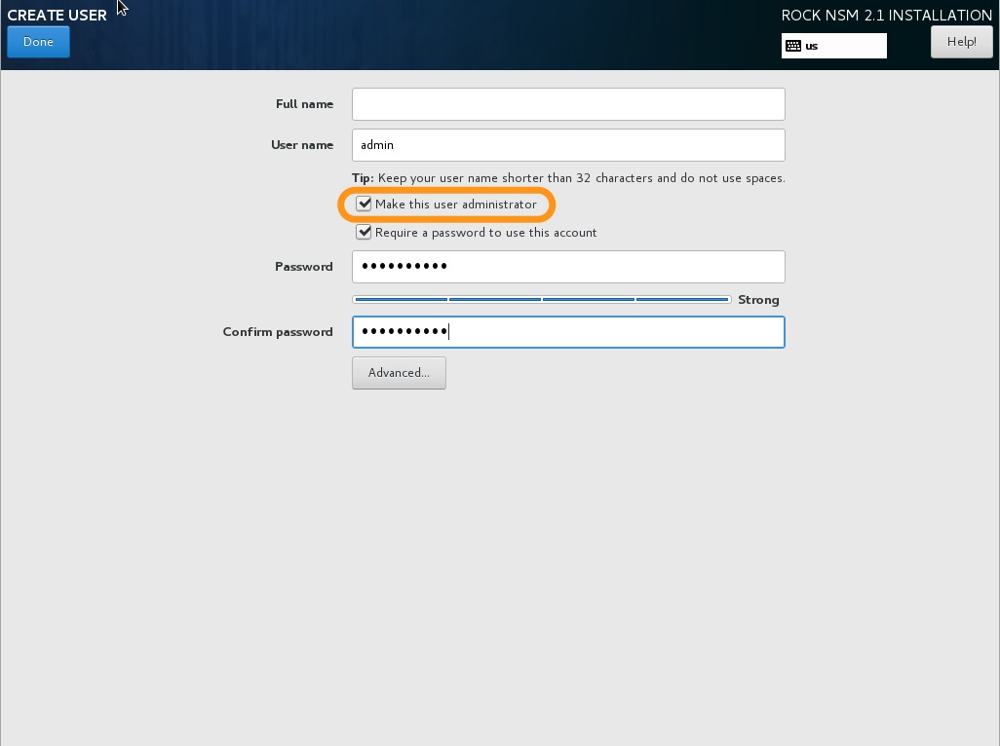

# Installation Guide

Let's just hold on for [one hot minute](https://youtu.be/UIyMhzU655o) before
installing, just in case you like to skip around.

It's dangerous to deploy sensors alone... take these _[minumum requirements](./requirements.md)_:  

- 8GB RAM
- 4 Physical Cores
- 256GB disk
- 2 NICs
    - active connection on mgmt port

## Network Connection
This is a critical setup point:  

> Before booting to the ISO, connect the network interface that you intend to
use to remotely manage ROCK.

Why? During install, ROCK will see the network interface with an ip address and
default gateway and designate it as the _**management**_ port. So plug into that
interface and boot to your USB drive.  

## Install Types
ROCK works with both legacy BIOS and UEFI booting.  Once booted from the USB, you are presented with 2 primary installation paths:  

1. **Automated**
1. **Custom**

 

### Automated
The "Automated" option is intended to serve as a _**starting point**_ that allows you to get into things.  It uses the Centos Anaconda installer to make some of the harder decisions for users by skipping over many options to get you up and running. It makes a best guess at how to use resources -- most notably how to manage available disks.  

Bottom line: think of this as a product quickstart mode, perfect for installing on a VM or other temporary hardware. It is _**not**_ for production sensor deployment.

> **For the rest of this install guide we'll work through the more detail oriented "Custom Install of ROCK" option.**

### Custom
The "Custom" allows for more customization of a ROCK installation. This is especially helpful when you're working with multiple disks or even a large amount of storage on a single disk. The Custom option is recommended for production environments in order to get more granular in choosing how disk space is allocated.

#### Disk Allocation
Configuring disk and storage is a deep topic on it's own, but let's talke about a few examples to get started:  

##### Stenographer
A common gotcha occurs when you want full packet capture (via [Stenographer](../services/stenographer.md)), but it isn't given a separate partition.  Stenographer is great at managing it's own disk space (starts to overwrite oldest data at 90% capacity), but that doesn't cut it when it's sharing the same mount point as Bro, Suricata , and other tools that generate data in ROCK.

Best practice would be to create a `/data/stenographer` partition in order to prevent limited operations. For example, Elasticsearch will (rightfully) lock indexes up to a read-only state in order to keep things from crashing hard.

##### System Logs
Another useful partition to create is `/var/log` to separate system log files from the rest of the system.

##### Example Table
Below is a good starting point when partitioning

|   MOUNT POINT   |        USAGE      |   SIZE   |
| ---------- | ----------------- | -------- |
| **SYSTEM** | **SYSTEM** | **SYSTEM** |
| /          | root filesystem   | 15 GiB   |
| /boot      | legacy boot files | 512 MiB  |
| /boot/efi  | uefi boot files   | 512 MiB  |
| swap       | memory shortage   | ~8 GiB+ |
| **DATA** | **DATA** | **DATA** |
| /var/log           | system log files | ~15 GiB |
| /home              | user home dirs | ~20 GiB |
| /data              | data partition | ~ GiB |
| /data/stenographer | steno partition | ~ GiB |
 

For more information to assist with the partitioning process, you can see the [RHEL guide](https://access.redhat.com/documentation/en-us/red_hat_enterprise_linux/7/html/installation_guide/sect-disk-partitioning-setup-x86#sect-custom-partitioning-x86). Also, it may be a bit more self explanatory for you if you click “automatic partitions” then modify accordingly.
 

#### Date & Time
`UTC` is generally preferred for logging data as the timestamps from anywhere in the world will have a proper order without calculating offsets and daylight savings. That said, Kibana will present the Bro logs according to your timezone (as set in the browser). The bro logs themselves (i.e. in /data/bro/logs/) log in [epoch time](https://en.wikipedia.org/wiki/Unix_time) and will be written in UTC regardless of the system timezone.

Bro includes a utility for parsing these on the command line called `bro-cut`. It can be used to print human-readable timestamps in either the local sensor timezone or UTC. You can also give it a custom format string to specify what you'd like displayed.

#### Network & Hostname

Before beginning the install process it's best to connect the interface you've selected to be the **management interface**.  Here's the order of events:  

- ROCK will initially look for an interface with a default gateway and treat that interface as the MGMT INTERFACE
- All remaining interfaces will be treated as MONITOR INTERFACES

1. Ensure that the interface you intend to use for MGMT has been turned on and has an ip address
2. Set the hostname of the sensor in the bottom left corner
  - this hostname will populate the Ansible inventory file in `/etc/rocknsm/hosts.ini`  

#### User Creation
ROCK is configured with the root user disabled.  We recommend that you leave it that way.  Once you've kicked off the install, click **User Creation** at the next screen (shown above) and complete the required fields to set up a non-root admin user.  

> If this step is not completed during install, do not fear. you will be prompted to create this account after first login.

#### Wrapping Up

Once the install is complete you will be able to click **Finish Installation**
and then reboot.

You can then accept the license agreement: `c`(ontinue) + `ENTER`  

The `sshd` services is enabled at startup, so if you intend to complete the next
steps remotely, note the management ip address now by running `ip a`.  
