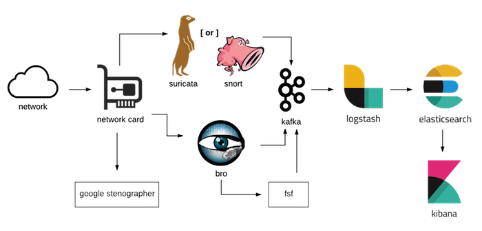

# ROCK Overview

What exactly sets ROCK apart from the other products in the space?

## Foundation

* ROBUST - we believe the folks at Red Hat do Linux right.  ROCK is built on Centos7 and provides an easy path to a supported enterprise OS ([RHEL](https://www.redhat.com/en)).

* SECURE - with SELinux, ROCK is secure by default.  [SELinux](https://selinuxproject.org/page/Main_Page) uses context to define security controls to prevent, for instance, a text editor process from talking to the internet.  **#setenforce1**

* SCALABLE - Whether you're tapping a SoHo network or a large enterprise, ROCK is designed with scale in mind.

## Capability

* Passive data acquisition via AF_PACKET, feeding systems for metadata (Bro), signature detection (Suricata or Snort), and full packet capture (Stenographer).

* A messaging layer (Kafka and Logstash) that provides flexibility in scaling the platform to meet operational needs, as well as providing some degree of data reliability in transit.

* Reliable data storage and indexing (Elasticsearch) to support rapid retrieval and analysis (Kibana) of the data.

## Components

* Full Packet Capture via [Google Stenographer](https://github.com/google/stenographer).

* Protocol Analysis and Metadata via [Bro](https://www.bro.org/).

* Signature Based Alerting via [Suricata](https://suricata-ids.org/) or [Snort](https://snort.org/).

* Recursive File Scanning via [FSF](https://github.com/EmersonElectricCo/fsf).

* Message Queuing and Distribution via [Apache Kafka](http://kafka.apache.org/).

* Message Transport via [Logstash](https://www.elastic.co/products/logstash).

* Data Storage, Indexing, and Search via [Elasticsearch](https://www.elastic.co/).

* Data UI and Visualization via [Kibana](https://www.elastic.co/products/kibana).

---

Continue with the [Quickstart Guide](../quick_start/index.md) to get up and running.
