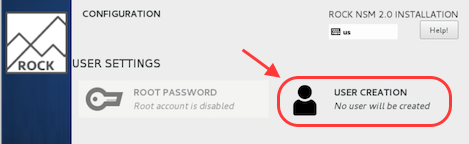

# Installation Guide

TL;DR - Installation is simple and straighforward.

1. apply image
1. generate defaults
1. confirm / edit config
1. deploy


## Apply the Image

Installing from the [ISO](https://github.com/rocknsm/rock/releases) is the preferred method to set up ROCK.  If that's for some reason not an option, alternate methods are listed [here](alt_install.md).

NOTE:  If you need details on how to apply the image to your USB or optical disk, see [media prep](media_prep.md).

1. once booted to the live image, select the automated install and 'ENTER'.

1. click **User Creation** at the next screen complete the required fields to set up a non-root admin user.

<p align="center">

</p>

1. click **Finish Installation** and wait for reboot

1. accept licensing agreement

1. update Centos to current by running: `sudo yum update -y && reboot`


## Generate Defaults

After applying updates ROCK needs a default configuration to build upon.  This is done by running the aptly named named script as the admin user you created:

1. `cd /opt/rocknsm/rock`

1. `sudo ./generate_defaults.sh`

1. if this is successful you will see:

**`Defaults generated. Adjust /etc/rocknsm/config.yml as needed.`**


## Confirm Config

One of the defaults generated in the previous step is the configuration file:

`/etc/rocknsm/config.yml`

This creates key variables like network interface setup, cpu cores used, what components are enabled, and much more.  Take care with these options as this file will be read during the next step, deployment.

## Deploy

Once your config file is tuned to your situation, it's time to deploy!  This is done by running the deployment script:

1. `cd /opt/rocknsm/rock/bin/`

1. `sudo ./deploy_rock.sh`

If everything is well, this should set up all the components you selected and give you a success banner similar to the example below:

```
PLAY RECAP *******************************************************************************
simplerockbuild.simplerock.lan : ok=40   changed=2    unreachable=0    failed=0
```

---

When installation is complete, continue to the [Usage Guide](usage.md).

NOTE: For a detailed guide on how to set up a virtual machine to throw packets at see the [VM Build Guide](../../wiki/devel/vm_guide.md) wiki/dev section.
